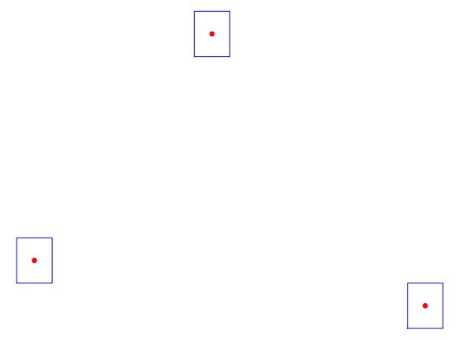
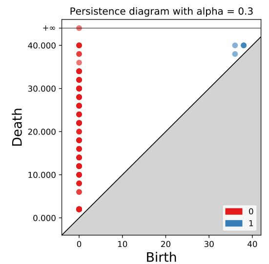
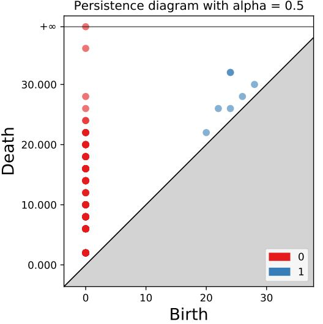
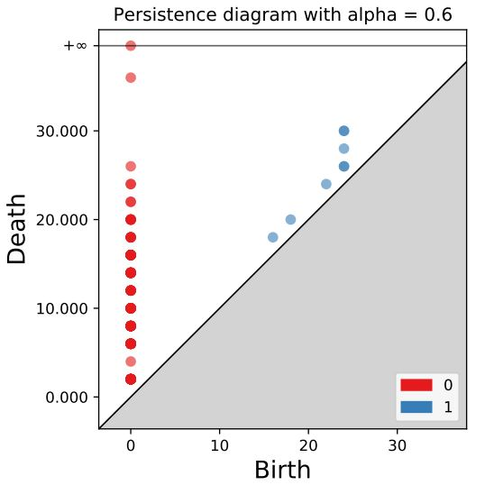
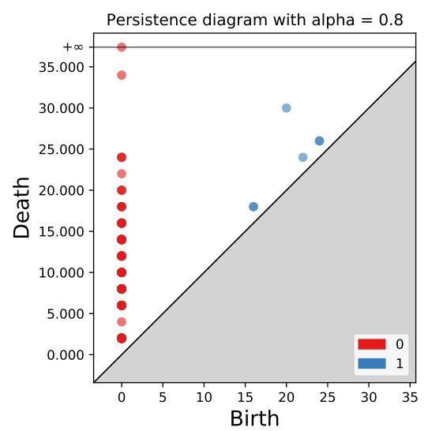

# Box-Filteration #
Topolgical data analysis is used for complex data analysis. In general, we grow balls to understand topology of point cloud. We came up with a new technique where 
instead of growing balls we grow hypercubes with directional control over its expansion. 
# Installation #
1. conda env create --prefix ./env -f .\environment.yml
2. conda activate ./env
3. Run the scripts in each of the examples
## Box Cover ##
Following example shows a toy problem of 3 points to demonstrate expansion of boxes and their corresponding nerves. 
For details checkout **examples/paper_example**.

     
     

## Persistence ##
Persistence diagram for box filteration with various values of parameter alpha = [0.1, 0.2, 0.3, 0.4, 0.5, 0.6, 0.7, 0.8, 0.9] for a given 2d point cloud. For details checkout **examples/circle_2**. Other examples 
with various data distribution of circles are shown in **examples/circle_1,examples/circle_3, examples/circle_4**.  

           

## Mapper ##
Implemntation of mapper for various data distribution is shown down below. For details check out **examples/flamingo, examples/elephant, examples/lion, examples/cat, examples/camel, examples/horse**.
Mapper images down below are linked to their detailed *html* file.     
     
     
     